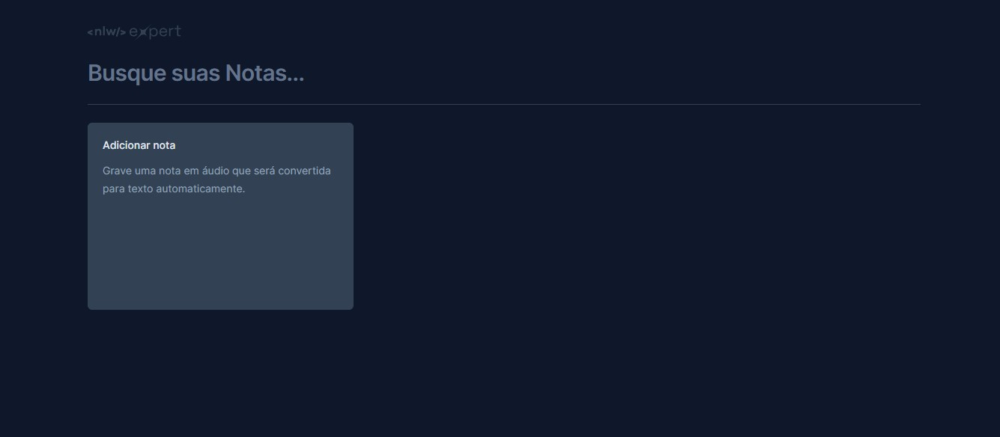

# Project Notes NLW Expert
Esse repositório foi desenvolvido durante a trilha de react da rocketseat. Notes NLW Expert é uma aplicação front-end responsiva de notas, que deixa o usuário crie e exclua notas de maneira simples e intuitiva, além disso está disponível a gravação de notas por áudio e a persistência de dados. 

# Funcionalidades
- Criação e gerenciamento de notas de forma dinâmica.
- Utilização da API SpeechRecognition para transcrição de fala em notas escritas.
- Mecanismo de busca para encontrar notas facilmente.
- Capacidade de salvar e excluir notas.
- Persistência de dados utilizando LocalStorage para evitar perda de informações.

# Tecnologias Utilizadas
- React.js
- Vite
- TypeScript
- Tailwind CSS
- Radix UI
- Date-fns
- Sonner
- Lucide React

# Projeto desenvolvido:
